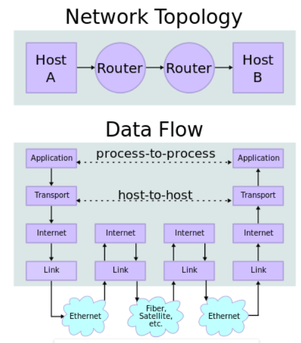

## TCP/IP

维基百科：https://zh.wikipedia.org/wiki/TCP/IP%E5%8D%8F%E8%AE%AE%E6%97%8F

互联网协议族（英语：Internet Protocol Suite，缩写IPS）是一个网络通信模型，以及一整个网络传输协议家族，为互联网的基础通信架构。它常被通称为TCP/IP协议族（英语：TCP/IP Protocol Suite，或TCP/IP Protocols），简称TCP/IP[2]。因为该协议家族的两个核心协议：TCP（传输控制协议）和IP（网际协议），为该家族中最早通过的标准[3]。由于在网络通讯协议普遍采用分层的结构，当多个层次的协议共同工作时，类似计算机科学中的堆栈，因此又被称为TCP/IP协议栈（英语：TCP/IP Protocol Stack）

整个通信网络的任务，可以划分成不同的功能区块，即所谓的层级（layer）。用于互联网的协议可以比照TCP/IP参考模型进行分类。TCP/IP协议栈起始于第三层协议IP（网际协议）。

<!--more-->

TCP/IP参考模型是一个抽象的分层模型，这个模型中，所有的TCP/IP系列网络协议都被归类到4个抽象的"层"中。每一抽象层创建在低一层提供的服务上，并且为高一层提供服务。 完成一些特定的任务需要众多的协议协同工作，这些协议分布在参考模型的不同层中的，因此有时称它们为一个协议栈。 TCP/IP参考模型为TCP/IP协议栈订身制作。其中IP协议只关心如何使得数据能够跨越本地网络边界的问题，而不关心如何利用传输媒体，数据如何传输。整个TCP/IP协议栈则负责解决数据如何通过许许多多个点对点通路（一个点对点通路，也称为一"跳", 1 hop）顺利传输，由此不同的网络成员能够在许多"跳"的基础上创建相互的数据通路。

## 因特网协议栈中的层

---
4 .  应用层application layer 例如HTTP、FTP、DNS（如BGP和RIP这样的路由协议，尽管由于各种各样的原因它们分别运行在TCP和UDP上，仍然可以将它们看作网络层的一部分）

3 . 传输层transport layer 例如TCP、UDP、RTP、SCTP（如OSPF这样的路由协议，尽管运行在IP上也可以看作是网络层的一部分）

2 .  网络互连层internet layer 对于TCP/IP来说这是因特网协议（IP）（如ICMP和IGMP这样的必须协议尽管运行在IP上，也仍然可以看作是网络互连层的一部分；ARP不运行在IP上）

1 . 网络接口层link layer 例如以太网、Wi-Fi、MPLS等。

### 应用层
该层包括所有和应用程序协同工作，利用基础网络交换应用程序专用的数据的协议。 应用层是大多数普通与网络相关的程序为了通过网络与其他程序通信所使用的层。这个层的处理过程是应用特有的；数据从网络相关的程序以这种应用内部使用的格式进行传送，然后被编码成标准协议的格式。
一些特定的程序被认为运行在这个层上。它们提供服务直接支持用户应用。这些程序和它们对应的协议包括HTTP（万维网服务）、FTP（文件传输）、SMTP（电子邮件）、SSH（安全远程登陆）、DNS（名称<-> IP地址寻找）以及许多其他协议。 一旦从应用程序来的数据被编码成一个标准的应用层协议，它将被传送到IP栈的下一层。

在传输层，应用程序最常用的是TCP或者UDP，并且服务器应用程序经常与一个公开的端口号相联系。服务器应用程序的端口由互联网号码分配局（IANA）正式地分配，但是现今一些新协议的开发者经常选择它们自己的端口号。由于在同一个系统上很少超过少数几个的服务器应用，端口冲突引起的问题很少。应用软件通常也允许用户强制性地指定端口号作为运行参数。
连结外部的客户端程序通常使用系统分配的一个随机端口号。监听一个端口并且通过服务器将那个端口发送到应用的另外一个副本以创建对等连结（如IRC上的dcc文件传输）的应用也可以使用一个随机端口，但是应用程序通常允许定义一个特定的端口范围的规范以允许端口能够通过实现网络地址转换（NAT）的路由器映射到内部。

每一个应用层（TCP/IP参考模型的最高层）协议一般都会使用到两个传输层协议之一： 面向连接的TCP传输控制协议和无连接的包传输的UDP用户数据报文协议。

### 常用的应用层协议有：
运行在TCP协议上的协议：
  ● HTTP（Hypertext Transfer Protocol，超文本传输协议），主要用于普通浏览。
  ● HTTPS（Hypertext Transfer Protocol over Secure Socket Layer, or HTTP over SSL，安全超文本传输协议）,HTTP协议的安全版本。
  ● FTP（File Transfer Protocol，文件传输协议），由名知义，用于文件传输。
  ● POP3（Post Office Protocol, version 3，邮局协议），收邮件用。
  ● SMTP（Simple Mail Transfer Protocol，简单邮件传输协议），用来发送电子邮件。
  ● TELNET（Teletype over the Network，网络电传），通过一个终端（terminal）登陆到网络。
  ● SSH（Secure Shell，用于替代安全性差的TELNET），用于加密安全登陆用。
运行在UDP协议上的协议：
  ● BOOTP（Boot Protocol，启动协议），应用于无盘设备。
  ● NTP（Network Time Protocol，网络时间协议），用于网络同步。
  ● DHCP（Dynamic Host Configuration Protocol，动态主机配置协议），动态配置IP地址。
其他：
  ● DNS（Domain Name Service，域名服务），用于完成地址查找，邮件转发等工作（运行在TCP和UDP协议上）。
  ● ECHO（Echo Protocol，回绕协议），用于查错及测量应答时间（运行在TCP和UDP协议上）。
  ● SNMP（Simple Network Management Protocol，简单网络管理协议），用于网络信息的收集和网络管理。
  ● ARP（Address Resolution Protocol，地址解析协议），用于动态解析以太网硬件的地址。

### 传输层
传输层的协议，能够解决诸如端到端可靠性（“数据是否已经到达目的地？”）和保证数据按照正确的顺序到达这样的问题。在TCP/IP协议组中，传输协议也包括所给数据应该送给哪个应用程序。 在TCP/IP协议组中技术上位于这个层的动态路由协议通常被认为是网络层的一部分；一个例子就是OSPF（IP协议89）。 TCP（IP协议6）是一个“可靠的”、面向连结的传输机制，它提供一种可靠的字节流保证数据完整、无损并且按顺序到达。TCP尽量连续不断地测试网络的负载并且控制发送数据的速度以避免网络过载。另外，TCP试图将数据按照规定的顺序发送。这是它与UDP不同之处，这在实时数据流或者路由高网络层丢失率应用的时候可能成为一个缺陷。 较新的SCTP也是一个“可靠的”、面向连结的传输机制。它是面向纪录而不是面向字节的，它在一个单独的连结上提供通过多路复用提供的多个子流。它也提供多路自寻址支持，其中连结终端能够被多个IP地址表示（代表多个实体接口），这样的话即使其中一个连接失败了也不中断。它最初是为电话应用开发的（在IP上传输SS7），但是也可以用于其他的应用。 UDP（IP协议号17）是一个无连结的数据报协议。它是一个“尽力传递”（best effort）或者说“不可靠”协议——不是因为它特别不可靠，而是因为它不检查数据包是否已经到达目的地，并且不保证它们按顺序到达。如果一个应用程序需要这些特性，那它必须自行检测和判断，或者使用TCP协议。 UDP的典型性应用是如流媒体（音频和视频等）这样按时到达比可靠性更重要的应用，或者如DNS查找这样的简单查询／响应应用，如果创建可靠的连结所作的额外工作将是不成比例地大。 DCCP目前正由IEFT开发。它提供TCP流动控制语义，但对于用户来说保留UDP的数据报服务模型。 TCP和UDP都用来支持一些高层的应用。任何给定网络地址的应用通过它们的TCP或者UDP端口号区分。根据惯例使一些大众所知的端口与特定的应用相联系。 RTP是为如音频和视频流这样的实时数据设计的数据报协议。RTP是使用UDP包格式作为基础的会话层，然而据说它位于因特网协议栈的传输层。

### 网络互连层
TCP/IP协议族中的网络互连层（internet layer）在OSI模型中叫做网络层（network layer）。
正如最初所定义的，网络层解决在一个单一网络上传输数据包的问题。类似的协议有X.25和ARPANET的Host/IMP Protocol。 随着因特网思想的出现，在这个层上添加附加的功能，也就是将数据从源网络传输到目的网络。这就牵涉到在网络组成的网上选择路径将数据包传输，也就是因特网。 在因特网协议组中，IP完成数据从源发送到目的的基本任务。IP能够承载多种不同的高层协议的数据；这些协议使用一个唯一的IP协议号进行标识。ICMP和IGMP分别是1和2。 一些IP承载的协议，如ICMP（用来发送关于IP发送的诊断信息）和IGMP（用来管理多播数据），它们位于IP层之上但是完成网络层的功能，这表明因特网和OSI模型之间的不兼容性。所有的路由协议，如BGP、OSPF、和RIP实际上也是网络层的一部分，尽管它们似乎应该属于更高的协议栈。  
### 网络接口层
网络接口层实际上并不是因特网协议组中的一部分，但是它是数据包从一个设备的网络层传输到另外一个设备的网络层的方法。这个过程能够在网卡的软件驱动程序中控制，也可以在韧体或者专用芯片中控制。这将完成如添加报头准备发送、通过实体媒介实际发送这样一些数据链路功能。另一端，链路层将完成数据帧接收、去除报头并且将接收到的包传到网络层。 然而，链路层并不经常这样简单。它也可能是一个虚拟专有网络（VPN）或者隧道，在这里从网络层来的包使用隧道协议和其他（或者同样的）协议组发送而不是发送到实体的接口上。VPN和隧道通常预先建好，并且它们有一些直接发送到实体接口所没有的特殊特点（例如，它可以加密经过它的数据）。由于现在链路“层”是一个完整的网络，这种协议组的递归使用可能引起混淆。但是它是一个实现常见复杂功能的一个优秀方法。（尽管需要注意预防一个已经封装并且经隧道发送下去的数据包进行再次地封装和发送）。
