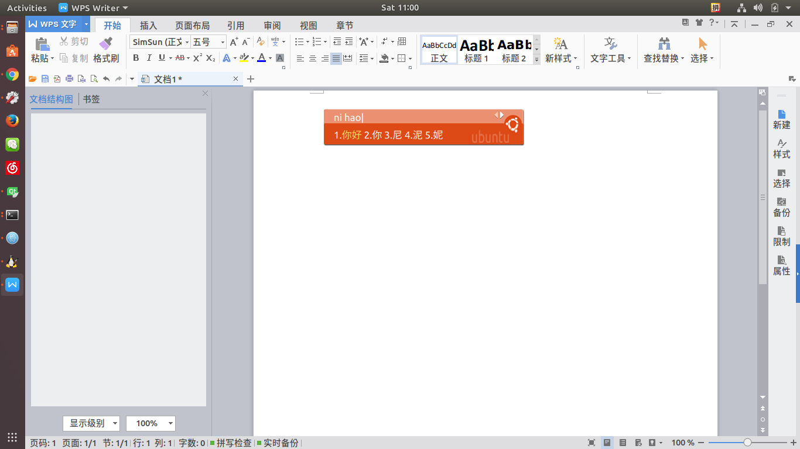
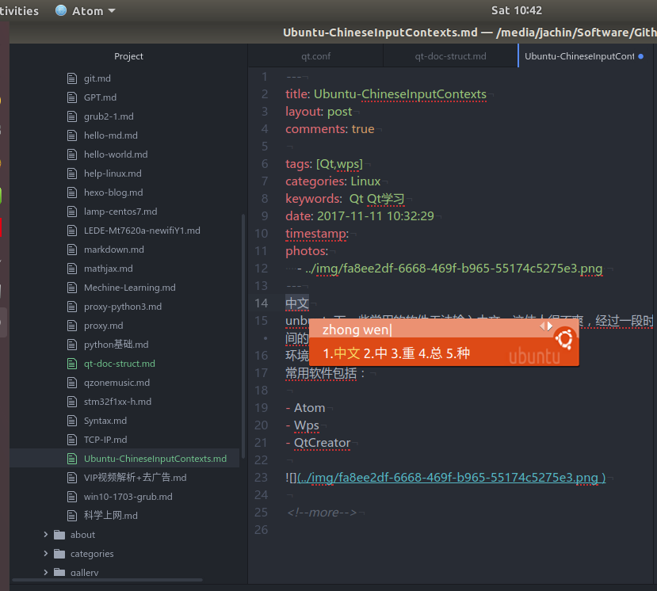

unbuntu下一些常用的软件无法输入中文，这使人很不爽，经过一段时间的努力基本解决了系统中文输入以及常用软件输入中文的问题！
环境为Ubuntu17.10 （17.04同样适用）。
常用软件包括：

- Atom
- Wps
- QtCreator

<!--more-->

## 系统中文输入

看图，不多说：


效果图：


## Qt QtCreator

```
    sudo apt-get install fcitx-libs-qt fcitx-libs-qt5

    cp /usr/lib/x86_64-linux-gnu/qt5/plugins/platforminputcontexts/libfcitxplatforminputcontextplugin.so  ~/qtcreator-4.4.0/lib/Qt/plugins/platforminputcontexts/
```
以上操作其实就是安装fcitx-libs-qt和fcitx-libs-qt5的库，然后将动态链接拷贝到qtcreator的插件目录中，至于为什么是这个目录需要你自己去发现，不过我们可以看到在该目录中已经存在ibux的动态链接库，我们只是把fcitx的加进去而已。


当然你也可以不拷贝直接将libfcitxplatforminputcontextplugin.so所在的目录加入到环境变量中应该也是可以的（我没有测试）：

```
sudo vim /etx/bash.bashrc
```
在文件最后添加一行：
```
export $PATH = $PATH:/usr/lib/x86_64-linux-gnu/qt5/plugins/platforminputcontexts/
```

到此重启qtcreator已经可以输入中文了。就是这么简单！
效果图：


## Wps


google搜到的解决办法,(亲测在Ubuntu17.04&17.10中无效)

> wps文字不能输入中文解决  

```
$ vim /usr/bin/wps      
```
修改wps启动文件：

```
#!/bin/bash
export XMODIFIERS="@im=fcitx"
export QT_IM_MODULE="fcitx"
gOpt=
#gOptExt=-multiply
gTemplateExt=("wpt" "dot" "dotx")
```

wps writer,表格，ppt对应的启动文件分别为：

```
    /usr/bin/wps
    /usr/bin/et
    /usr/bin/wpp
```


以上方式在17.04和17.10中亲测无效！！！

受到qtcreator的启示，同样将libfcitxplatforminputcontextplugin.so动态链接库拷贝到wps的目录中，wps的目录位于：

```
/opt/kingsoft/wps-office/office6
```
可以看到在office6目录下有一个这样的路径：

```
/opt/kingsoft/wps-office/office6/qt/plugins/
```
和qtcreator的很相似，只是没有platforminputcontexts这个下一级目录，由于强迫症就建立一个这个目录（其实不建也是可以的）把libfcitxplatforminputcontextplugin.so拷贝进来，然后启动wps发现完美解决。

```
sudo mkdir /opt/kingsoft/wps-office/office6/qt/plugins/platforminputcontexts

sudo cp  /usr/lib/x86_64-linux-gnu/qt5/plugins/platforminputcontexts/libfcitxplatforminputcontextplugin.so  /opt/kingsoft/wps-office/office6/qt/plugins/platforminputcontexts/

fcitx-autostart

wps
```
效果图：



## Atom

Atom 我没有测试上面的方法，应该也是可以的。我的解决办法是编译安装。

Atom的官方网址：[https://atom.io/](https://atom.io/)

binary包安装以后无法输入中文，后来采用编译安装问题的到解决。

编译安装参考：[http://flight-manual.atom.io/hacking-atom/sections/hacking-on-atom-core/#platform-linux](http://flight-manual.atom.io/hacking-atom/sections/hacking-on-atom-core/#platform-linux)


效果图：



## 总结

以上通过安装 fcitx-libs-qt fcitx-libs-qt5，然后将动态链接库拷贝到软件的启动目录（或者特定的库目录中）完美解决了Qtcreator，wps，Atom在Ubuntu中的中文输入问题！！Enjoy your Ubuntu!
<
