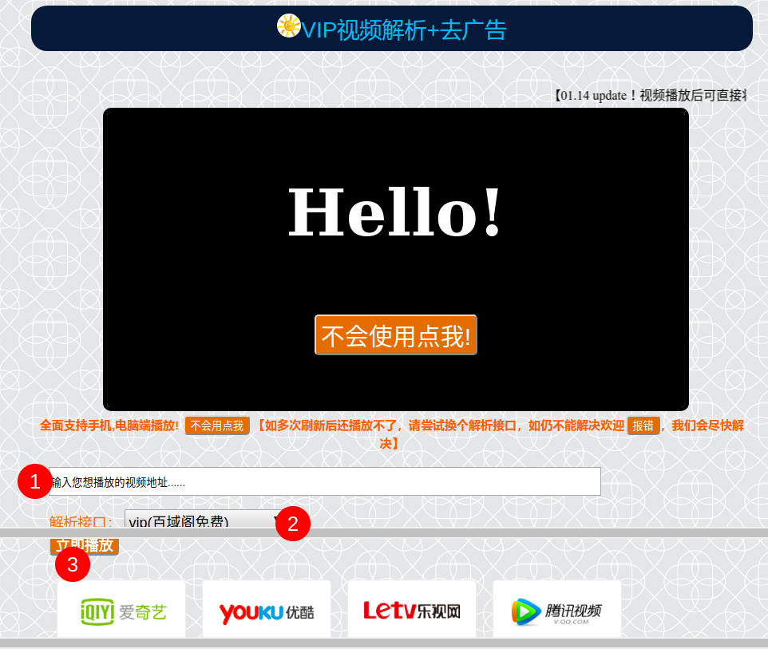
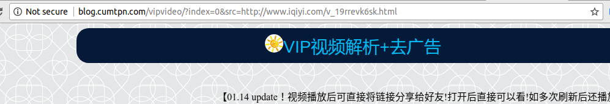
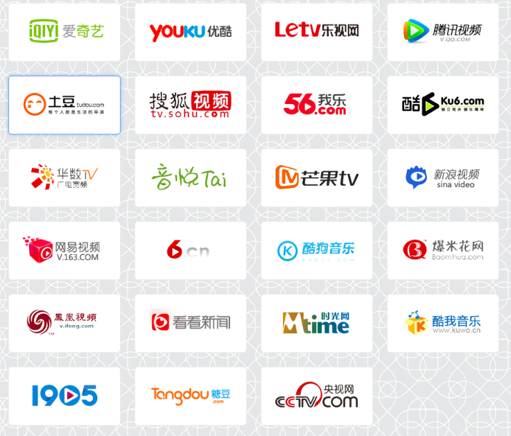

# VIP视频解析+去广告教程

## Step1.打开视频网站

这里以爱奇艺为例 <http://www.iqiyi.com> 打开首页看到类似下面的界面：

<!--more-->

## Step2.找到你要看的视频

在视频网站中找到你想要看的视频，看到类似下面的界面：

* `点击1` 指的地方，这里可以看到选择是一个需要VIP才能观看的《河神EP04》，这里无意冒犯出版商版权，多有得罪，提倡大家购买正版观看！
* `复制2` 指的链接

## Step3.打开[VIP视频解析+去广告](http://blog.cumtpn.com/vipvideo)

将刚才复制的链接粘贴到输入框中，入下图所示：

* `1→`为输入框，输入在视频网站找到的视频链接
* `2→`为解析接口选择，在无法解析的情况下可以在这里换解析接口，另外支持自定义解析接口。
* `3→`为理解播放按钮，点击即可观看，并且没有广告哟！

## Step4.分享
浏览器地址栏中的链接复制下来发送给好友，好友打开直接可以观看当前的影片！

支持的网站：

