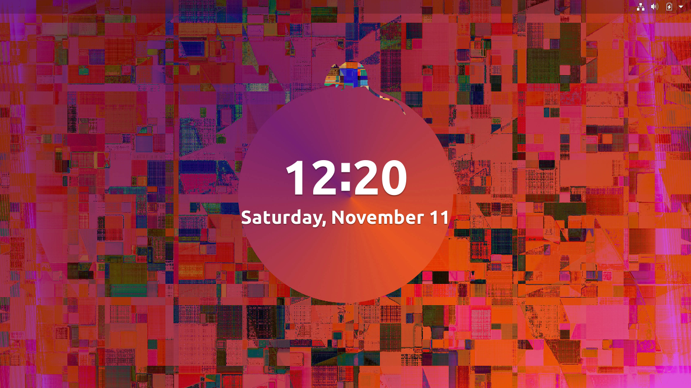
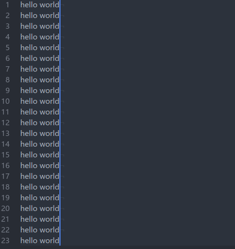
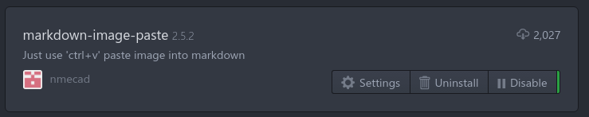
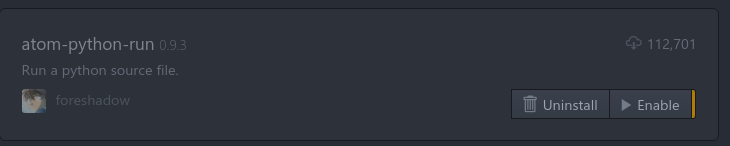

转战Linux后尝试过不少的发行版Mint，Deepin等，换来换去最后还是换成了ubuntu。
Ubuntu17.10后回归Gnome桌面，真的越来越棒了！当然选择Linux作为日常live系统最大
的问题就是缺少很多日常必须的软件，比如QQ，office，还有一些音乐视频等娱乐软件。
本文带你打造一个完美的能够满足日常娱乐与学习的Linux系统！发行版为：Ubuntu17.10

<!--more-->

## 美图

几张系统美图：

## Step1.浏览器Chrome&FireFox

浏览器是日常使用的top1。在Ubuntu下也有很多浏览器可以选择，我的搭配为Chrome为主，FireFox为辅。选择Chrome后可以在Chrome的基础上安装很多的Chrome App。

### Chrome
Chrome主页：https://www.google.com/chrome/browser/desktop/index.html#
（需要梯子自寻）

Chrome安装很简单在上面的链接中下着二进制包安装即可！

### FireFox
Firefox主页：https://www.mozilla.org/en-US/firefox/new/

## Step2. 编辑器[Atom](https://atom.io)

Atom主页：<https://atom.io>
程序员最不可缺少的就是一个好的编辑器。Atom是万能的，开源，有很多的扩展包可以使用。

必须扩展包：

### Sublime-Style-Column-Celection
区块编辑支持

### gcc-make-run
c文件快速编译运行

### markdown-image-paste
最棒的插件之一！！！在md文件编辑中，截图以后直接打出文件名然后Ctrl+V将图片存到配置好的目录中，并生成Markdow 图片链接。

### uuidgen
在粘贴md的图片时总是要起文件名也是一件麻烦的事，还要保证不重复。uuidgen完美解决这个问题！只要快捷键Alt+Commend+G即生成一个uuid。保证不会重复！

###  atom-python-run
快速python运行！

 ### markdown-preview-plus
 markdown预览，支持latex公式嵌入。

 ### markdown-scroll-sync
 markdown预览时同步滚动。

## Step3.音乐

听歌你可以选择网页：

http://music.163.com

https://youtube.com

但是你有更好的选择，就是Chrome app, Netease Music!

chrome app的启动是不依赖与chrome的界面的，因此你完全可以在不启动chrome的情况下直接启动music！

## Step4.微信（可作为QQ的替代品）
同样chrome app中安装Wechat，其实就是网页版的wechat封装成单独的app可以独立启动！这大概是我对微信刮目相看的唯一理由了。。QQ也是有chrome app的，但是选择wechat而不选择QQ是因为wechat的功能要强大的多！比如支持与好友或者手机互传文件！！！！对的你没看错是文件！！当然照片也是可以的！并且照片是支持截图后Ctrl+v直接粘贴发送的，是不是很方便。然而QQ只能发个表情包里面的表情。。

## Step5.office系列

office系列的软件有自带的liberate office，效果嘛，，谁用谁知道！....支持国产我们选择wps，完美兼容Mxx公司的几大坨。

wps 主页：http://wps-community.org/download.html

>Download [libpng12-0_1.2.50-2+deb8u2_amd64.deb](http://ftp.debian.org/debian/pool/main/libp/libpng/libpng12-0_1.2.50-2+deb8u3_amd64.deb). If you use a 32 bit system, download the 32 bit deb file.
>Install the package and then install wps-office.

## Step6.Foxit Reader

Foxit Reader完美支持Linux：

Foxit 主页：https://www.foxitsoftware.com/pdf-reader/

## Step7.视频播放器

SMplayer
