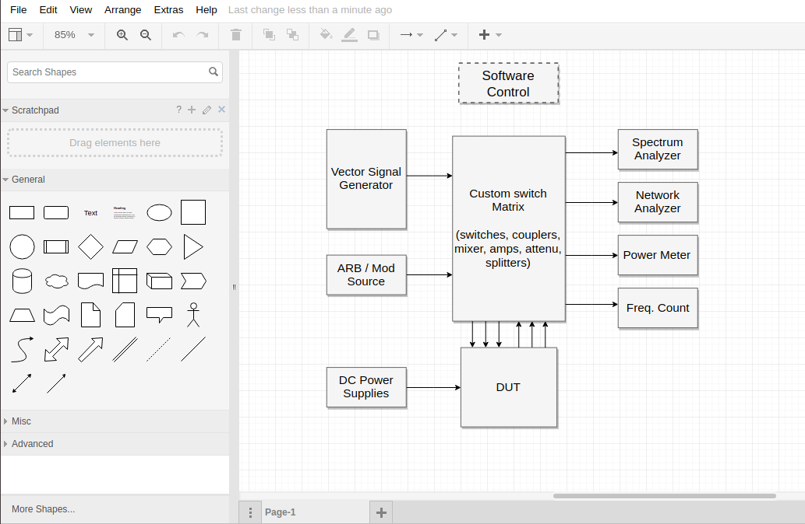
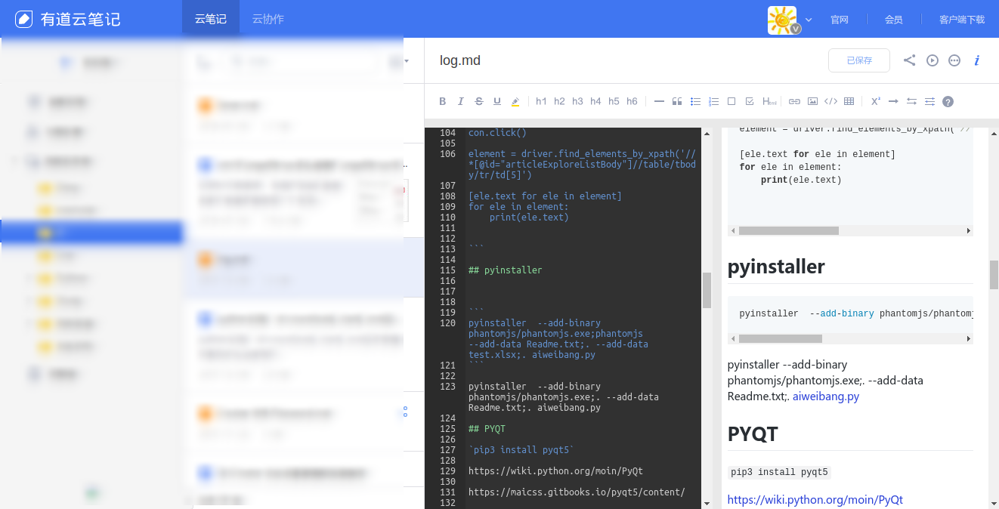

在上次介绍了一些基础的常用软件之后决定进一步探索！在知乎找到了一篇很棒的讨论，链接如下：
<https://www.zhihu.com/question/19811112>通过实践找出了我比较满意的软件。
由于本人电脑只有240G的固盘，电脑性能一般，因此对与内存和硬盘都是相当的奢侈，能原配的就不去搞些华丽胡哨的
东西，本着能简单绝不复杂，能默认绝不修改的原则去测试一些软件，以及一些脚本，特此记录以备后查！

<!--more-->

# No.1 Guake Terminal
这个名字有点意思，‘挂科’Terminal。。。功能很简单快速打开Terminal，或许你认为Ctrl+Alt+T（或者自己设置一个快捷键）去开Terminal也是一件很简单的事。没错我以前也是这么认为的，但是遇到了Guake后我改变了看法，特别是需要开多个Terminal的时候（高手都不需要开多个，一个都能全搞定！）系统的Terminal显的不方便，还有就是临时开一个
Terminal的时候很可能用完就不去关然后在那积攒了很多。Guake Terminal就是来解决这些问题的！一键弹出（默认F12），失去焦点自动关闭，可以开启多个Tab，可以自定义Appearance。


# No.2 ~/.bash_aliases

```
m_basedir='/media/jachin/Software'
#cd
alias pydir='cd ${m_basedir}/python'
alias soft='cd ${m_basedir}'
alias gitdir='cd ${m_basedir}/Github'


#python3 -m venv
alias pyvenv='python3 -m venv'
alias pyenv='pydir && source ./ENV/bin/activate'

#atom
alias atoma='atom -a'

#blog
alias blogdir='cd ${m_basedir}/Github/blog-hexo'
alias blog='pushd ${m_basedir}/Github/blog-hexo && atom -a ./  && popd'
alias blogd='pushd ${m_basedir}/Github/blog-hexo && hexo d -g  && popd'
alias blogs='pushd ${m_basedir}/Github/blog-hexo && hexo s -g  && popd'
```
配置后我只要F12 blog便用atom打开了我的blog目录，写完之后只要blogd就会执行上传！真的很方便！还可以写很多的快捷命令，搭配GuakeTerminal简直完美！有点像win下Listary。


```
pydir #进入python的目录
pyenv #进入python的目录并进入venv
atoma #以append的方式将目录添加到atom中

blogdir #进入到blog的目录
blog    #用atom打开blog目录
blogd   #上传
blogs   #本地测试
```

# No.3 [Draw.io](https://www.draw.io/)

有很多的模板可以使用，支持存储在本地，Github，google drive等，在线版的viso！





# No.4 有道云笔记

网易一向很良心，不像某讯。我以前是大象的忠实粉丝，在一次有道云笔记更新以后（支持新的网页版，和markdow的那次更新）我开始慢慢转移到了有道云！markdown，和网页版凭这两点就选择它了！因为我又能少装一个软件了。


# 每天进步一点点!!!

## **impossible is I'm possible!!!**
