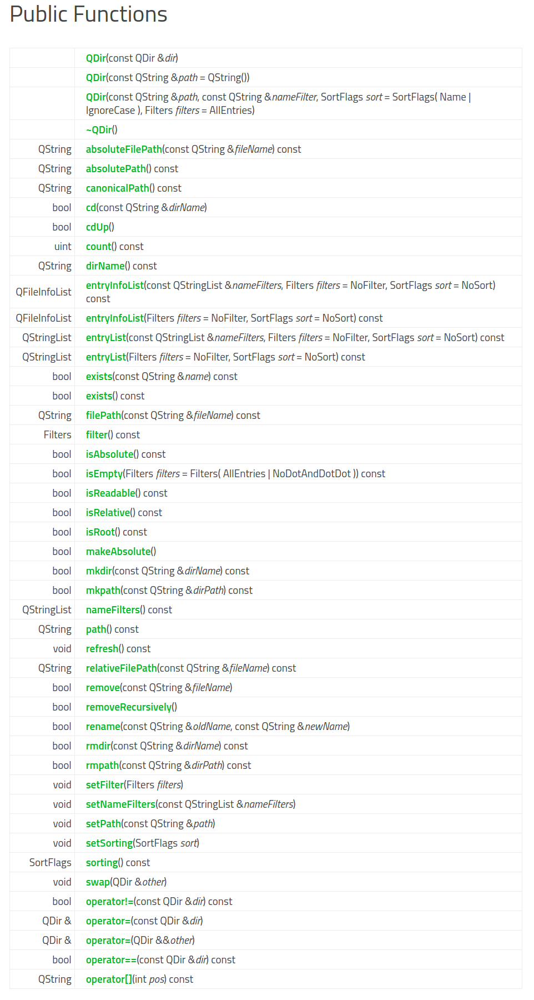
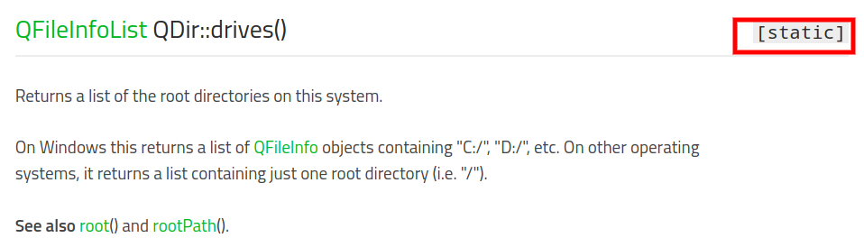
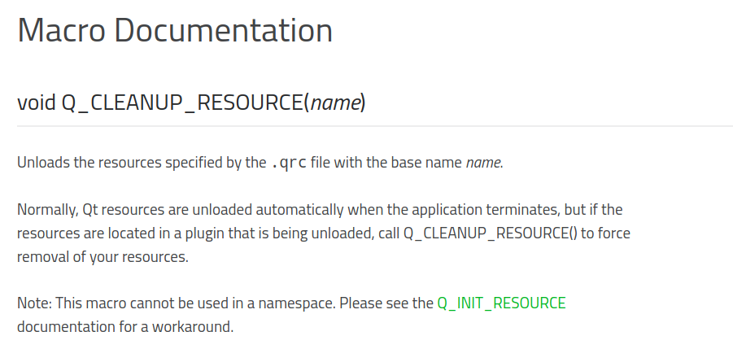

Qt的文档写的非常棒！学习QT最重要的就是学会看官方的文档，了解文档的结构有助于快速的查询文档，解决问题。Qt官方文档的主页为<http://doc.qt.io>


进入Qt Reference Documentation后可以看到Qt的文档还分为不同的分类，本文主要是介绍第一个分类：Class Lists


Class Lists中又有不同的索引方式，方便不同情景下查询：
 


Qt的class文档大致分为3个部分，Type（数据类型），Functions（成员函数），Macros（宏）。每个部分又分为两块，前一块是一个list，简单的列举，后一块为detail，详细信息。每个类的文档都是在同一个html页面上，采用锚点相互跳转，这也是非常棒的一点！

<!--more-->

## QDir Class *类名*


The QDir class provides access to directory structures and their contents. More... *简单介绍功能，可点击查看详细*


|  |  |
---|---
Header:|#include <QDir>
qmake:|QT += core

*说明header和qmake的包含操作*

---

## Public Types *公有的数据类型*


```
enum	Filter { Dirs, AllDirs, Files, Drives, ..., CaseSensitive }
flags	Filters
```

> The Filters type is a typedef for QFlags<Filter>. It stores an OR combination of Filter values.


## Public Functions *公有成员函数*


对象可以访问的函数,编程过程中主要查阅的就是这部分。

## Static Public Members  *静态成员函数*


解决同一个类不同对象之间的数据共享问题。主要作用是用来访问同一个类中的静态数据成员，维护对象之间的数据共享。

访问不依赖于对象。

可以通过对象与类名进行调用，一般习惯与用类名进行访问。


```
static QDir	current()

//example：

QDir::current()

//return a QDir Object of current directory.

```
## Macros 宏


---

## Detailed Description

该部分介绍QDir的整体概览。又分为小的章节进行介绍

### Navigation and Directory Operations

### Files and Directory Contents

### The Current Directory and Other Special Paths


### Path Manipulation and Strings

### Examples

---
## Member Type Documentation


具体的介绍数据类型

## Member Function Documentation



具体的介绍Function，包括static function。每个函数后有`See also xxx()`非常的方便。

## Macro Documentation

具体的介绍宏


## 实例

### [QDir](http://doc.qt.io/qt-5/qdir.html#QDir)
